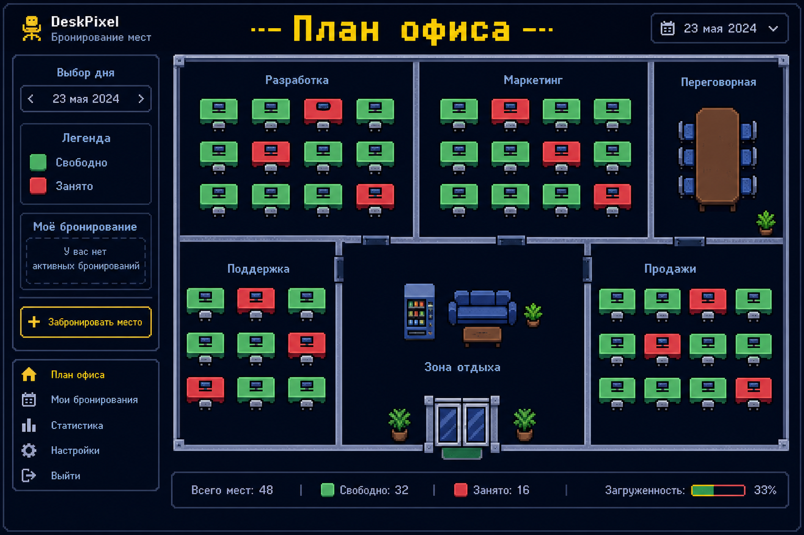
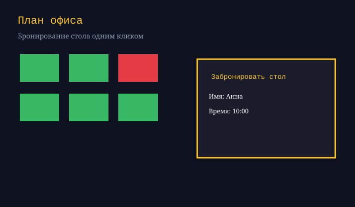
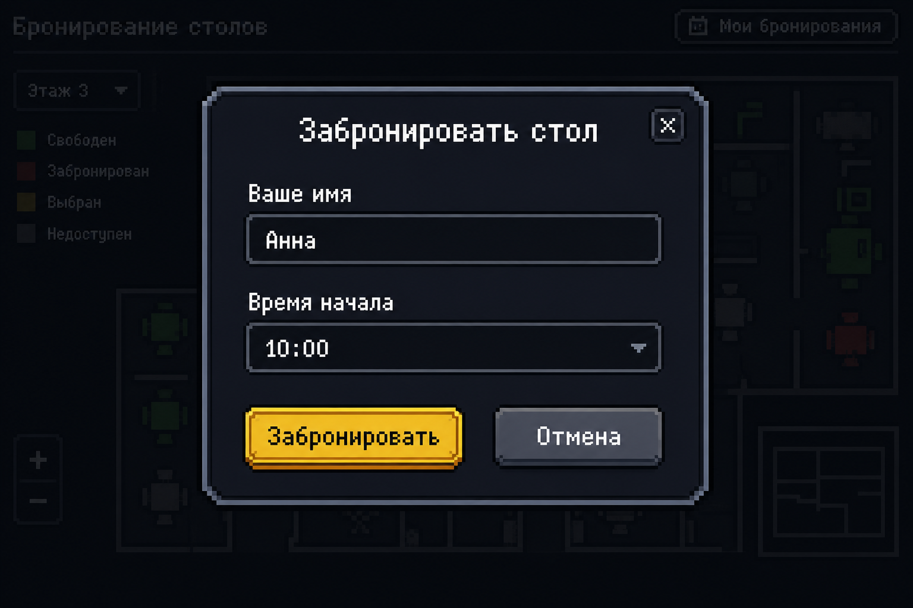
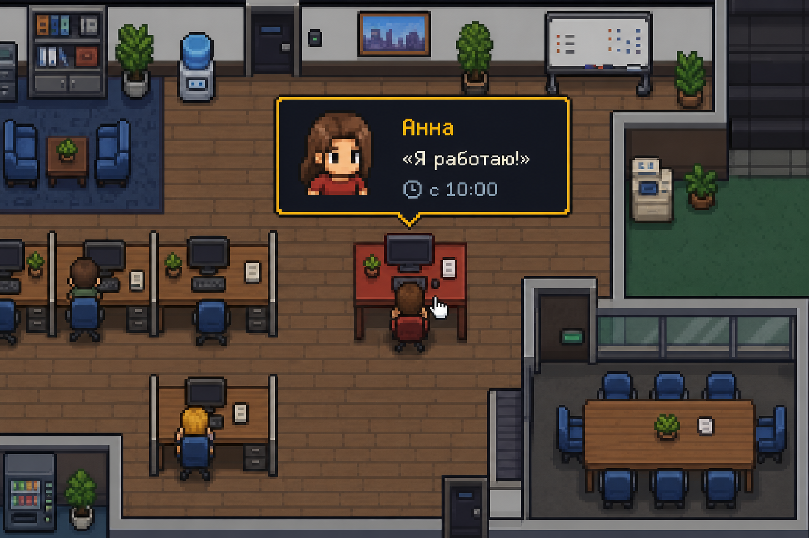

# План офиса — бронирование столов

Интерактивная SVG-карта офиса в минималистичном 8-bit стиле. Клик по столу открывает бронь на день. Все данные хранятся в LocalStorage — сервер не нужен.





## Возможности

- Три страницы: «Карта офиса», «Мои бронирования», «Аналитика загрузки» (тепловая карта)
- SVG-план офиса со столами (зелёный — свободно, красный — занято)
- Модальное окно бронирования: имя и время начала
- Фильтры: «У окна», «Переговорка», «Тихая зона»
- Подсказка при наведении на занятый стол: пиксельный аватар и цитата «Я работаю!»
- Скрытый режим администратора (кнопка в правом верхнем углу карты) — сброс всех броней
- Адаптив: от 320px до 1440px+
- Без бэкенда, без API-ключей, без `.env`





## Быстрый старт

```bash
npm install
npm run dev
```

Откройте адрес из терминала (обычно `http://localhost:5173`).

Сборка:

```bash
npm run build
npm run preview
```

## Тесты

Юнит-тесты:

```bash
npm test
```

E2E (Playwright):

```bash
npx playwright install chromium
npm run test:e2e
```

Все сразу:

```bash
npm run test:all
```

## Как пользоваться

1. Выберите тип мест фильтром или оставьте «Все места».
2. Кликните по зелёному столу.
3. Введите имя и время, нажмите «Забронировать».
4. Наведите на красный стол — увидите аватар и цитату сотрудника.
5. Чтобы освободить стол — кликните по нему и нажмите «Освободить стол».
6. Для полного сброса: едва заметная кнопка справа вверху → «Сбросить все брони».

## Архитектура

```
src/
  components/     # UI: карта, модалка, фильтры, подсказка, админ
  data/           # столы и константы
  services/       # LocalStorage + логгер
  utils/          # валидация, бизнес-логика, аватары (OffscreenCanvas)
  workers/        # Web Worker для статистики и фильтрации
  styles/         # стили (mobile-first)
e2e/              # сценарии Playwright
```

Данные бронирований: ключ `office-desk-bookings-v1` в LocalStorage. Брони старше текущего дня автоматически игнорируются.

## Технологии

React 18 · Vite · Vitest · Playwright · SVG · LocalStorage · Web Workers · OffscreenCanvas

## Лицензия

MIT — можно встраивать как коробочное решение для гибридных офисов и коворкингов.

## Отчёт о проверках

См. [docs/CHECKLIST.md](docs/CHECKLIST.md).
